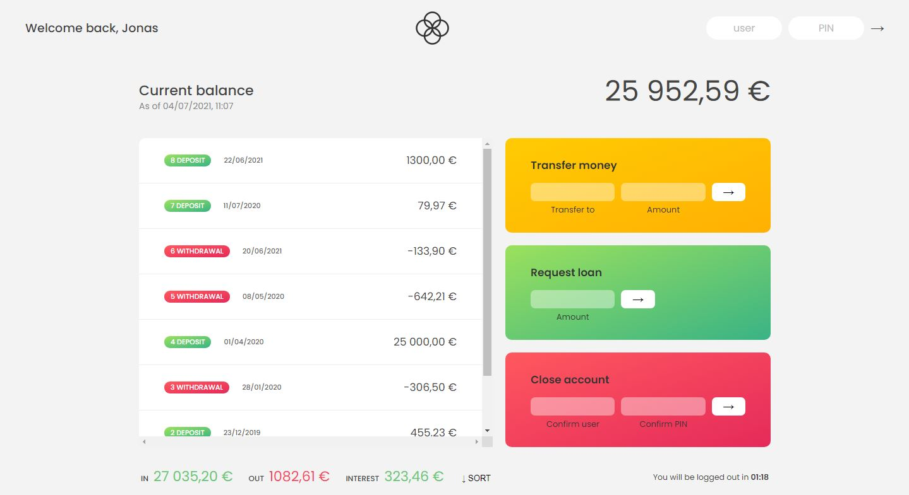

#  💸Bankist
<h1 align="center">
    
</h1>

## Login Keys

User : js  
Password : 1111

User : jd  
Password : 2222

[Live Demo](https://alyqamar.github.io/Bankist/) 

## :rocket: Technologies used:

Note: I coded the javascript code and use (html and css) code which coded by Jonas Schmedtmann. 

---

## ⭐ Features
- [x] Login, Logout
- [x] Transfer money
- [x] request loan
- [x] close account

## Resource

this project was developed in The Complete JavaScript Course 2022: From Zero to Expert! couse 
https://www.udemy.com/course/the-complete-javascript-course/

Created by [Jonas Schmedtmann](https://github.com/jonasschmedtmann)  
Developed by [@Aly Qamar](https://www.linkedin.com/in/alyqamar) - alyelsamouly@gmail.com  
